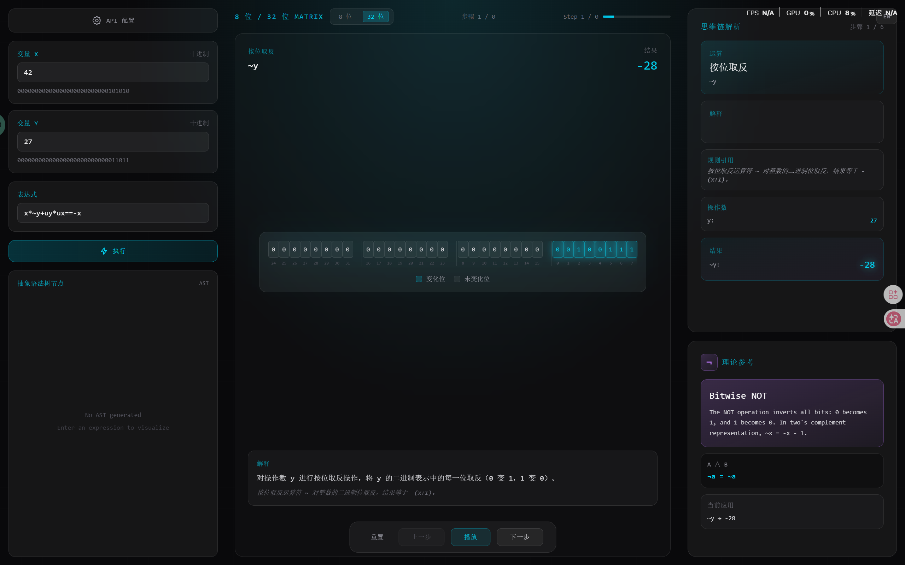
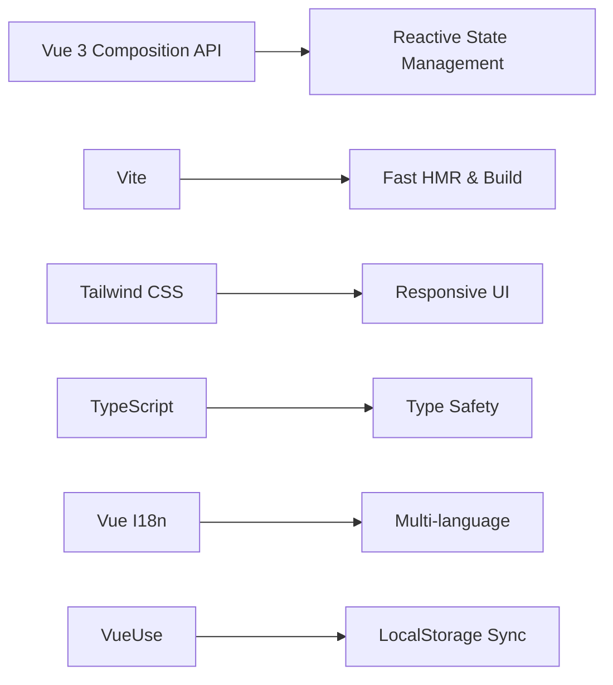

# 🧩 Interactive Bitwise Guide

<div align="center">

**交互式位运算可视化器 · 探索二进制世界的奥秘**

[](https://vuejs.org/)
[](https://vitejs.dev/)
[](https://www.typescriptlang.org/)
[](https://tailwindcss.com/)
[](LICENSE)
[](../../actions)


[特性](#-核心特性) • [快速开始](#-快速开始) • [功能演示](#-功能演示) • [技术架构](#-技术架构) • [部署指南](#-部署指南)

</div>

---

## 📖 项目简介

**Interactive Bitwise Guide** 是一款专为计算机科学教育设计的**位运算可视化工具**。它将抽象的二进制运算转化为直观的动态视觉效果，帮助学生、教育者和开发者深入理解计算机底层运算机制。

### 🎯 适用场景

- 🎓 **计算机组成原理** 课程教学辅助
- 💻 **数据结构与算法** 学习中的位运算技巧
- 🔍 **面试准备** - 位运算相关题目解析
- 🛠️ **底层开发** - 嵌入式、驱动开发中的位操作参考

---

## ✨ 核心特性

### 🎨 赛博叙事美学设计

采用 **Cyber-Narrative（赛博叙事）** 视觉风格，打造沉浸式学习体验：

- 🌌 **深色模式** - `bg-zinc-950` 背景，减少视觉疲劳
- 🔮 **毛玻璃效果** - `backdrop-blur-xl` 材质，科技感十足
- 💎 **青色强调** - `text-cyan-400` 高亮关键变化
- 📐 **等宽字体** - 完美对齐的二进制数字展示

### 🚀 实时可视化推演

- **动态比特高亮**：变化的位以脉冲动画实时展示
- **多模式切换**：支持 8 位 / 32 位两种显示模式
- **逐步推演**：支持单步、播放、暂停、重置等操作
- **思维链解析**：AI 逐步讲解每个运算步骤的逻辑

### 🌍 国际化支持

- 🇨🇳 **简体中文** & 🇬🇧 **英文** 完整双语支持
- 一键切换语言，界面实时响应
- AI 返回内容根据语言设置自适应

### 🔌 灵活的 AI 集成

- **OpenRouter 兼容** - 支持多种免费/付费模型
- **多模型切换** - 轻松切换不同 AI 提供商
- **智能降级** - API 不可用时自动切换到 Mock 数据
- **详细日志** - 完整的请求/响应调试信息

---

## 🎬 功能演示

### 🎬 视频演示

观看完整操作演示视频：

<div align="center">

<video width="640" controls preload="metadata">
  <source src="https://raw.githubusercontent.com/luobochuanqi/interactive-bitwise-guide/main/assets/videos/demo.mp4" type="video/mp4">
  Your browser does not support the video tag.
</video>

*演示视频：位运算表达式 `x & -x` 的完整推演过程*

</div>

> 💡 **提示**: 
> - 视频文件：3.8MB MP4 格式
> - 如果无法播放，请刷新页面或清除浏览器缓存

### 界面预览



*三栏式全景控制台布局：输入区 (25%) - 矩阵区 (50%) - 解析区 (25%)*

---

## 🛠️ 快速开始

### 前置要求

- Node.js 18+ & npm 9+
- 现代浏览器（Chrome 90+、Firefox 88+、Safari 14+）
- （可选）AI API 密钥（OpenRouter、OpenAI 等）

### 安装步骤

```bash
# 1. 克隆仓库
git clone https://github.com/your-username/webapp.git
cd webapp

# 2. 安装依赖
npm install

# 3. 启动开发服务器
npm run dev

# 4. 访问应用
# 浏览器打开 http://localhost:5173
```

### 可用命令

```bash
npm run dev      # 启动开发服务器（热重载）
npm run build    # 构建生产版本
npm run preview  # 预览生产构建
```

---

## 📦 项目结构

```
interactive-bitwise-guide/
├── README.md                # 项目文档
├── assets/                  # 媒体资源（图片、视频）
│   ├── images/
│   │   └── demo.png        # 演示截图
│   └── videos/
│       └── demo.mp4        # 演示视频
├── docs/                    # 项目文档
│   └── demo-expressions.md  # 演示表达式大全
└── webapp/                  # 应用源码
    ├── src/
    │   ├── components/      # Vue 组件
    │   │   ├── App.vue         # 主应用布局
    │   │   ├── SettingsPanel.vue    # API 配置面板
    │   │   ├── InputHub.vue         # 左侧输入区
    │   │   ├── BinaryMatrix.vue     # 中央二进制矩阵
    │   │   ├── CoTInterpreter.vue   # 思维链解析
    │   │   └── TheoryCards.vue      # 理论参考卡片
    │   ├── composables/     # Composition API 逻辑
    │   │   ├── useBitwiseSession.ts  # 会话管理核心
    │   │   ├── useBitwiseEngine.ts   # 二进制引擎
    │   │   └── useBitwiseAPI.ts      # API 请求封装
    │   ├── services/        # API 服务
    │   │   └── api.ts       # AI 请求服务（带重试机制）
    │   ├── types/           # TypeScript 类型定义
    │   │   └── bitwise.ts   # 核心数据结构
    │   ├── i18n/            # 国际化配置
    │   │   └── locales/     # 语言包
    │   │       ├── en.json  # 英文
    │   │       └── zh.json  # 中文
    │   ├── data/            # Mock 数据
    │   │   └── mock.ts      # 离线演示数据
    │   ├── lib/             # 工具函数
    │   │   └── utils.ts     # 通用辅助函数
    │   ├── App.vue          # 根组件
    │   └── main.ts          # 入口文件
    ├── public/              # 静态资源
    ├── index.html           # HTML 入口
    ├── package.json         # 项目配置
    ├── vite.config.ts       # Vite 配置
    └── tsconfig.json        # TypeScript 配置
```

---

## 🎯 核心功能

### 1️⃣ 表达式输入与变量配置

支持自定义位运算表达式：

```
默认示例：x*~y+uy*ux==-x
变量 X: 42 (二进制：00101010)
变量 Y: 27 (二进制：00011011)
```

**支持的运算符：**
- `~` 按位取反
- `&` 按位与
- `|` 按位或
- `^` 按位异或
- `<<` 左移
- `>>` 右移
- `>>>` 无符号右移

### 2️⃣ 二进制推演矩阵

动态展示每一步运算过程：

```
┌─────┬─────┬─────┬─────┬─────┬─────┬─────┬─────┐
│  0  │  0  │  1  │  0  │  1  │  0  │  1  │  0  │  ← X = 42
└─────┴─────┴─────┴─────┴─────┴─────┴─────┴─────┘
         ↓ 按位取反 (~)
┌─────┬─────┬─────┬─────┬─────┬─────┬─────┬─────┐
│  1  │  1  │  0  │  1  │  0  │  1  │  0  │  1  │  ← ~X = -43
└─────┴─────┴─────┴─────┴─────┴─────┴─────┴─────┘
    ▲     ▲     ▲     ▲     ▲     ▲     ▲     ▲
    └──── 变化的位（高亮显示）────┘
```

### 3️⃣ AI 驱动的思维链解析

AI 逐步讲解运算逻辑：

```markdown
**步骤 1: 按位取反运算**
- 操作数：X = 42 (00101010)
- 运算：~42
- 结果：-43 (11010101)
- 规则：每一位取反，0→1, 1→0
- 说明：在补码表示中，~x = -x - 1
```

### 4️⃣ 理论参考卡片

根据运算类型自动显示相关理论：

- **与运算 (AND)** - 逻辑合取，全 1 为 1
- **或运算 (OR)** - 逻辑析取，有 1 为 1
- **非运算 (NOT)** - 逻辑否定，按位取反
- **异或运算 (XOR)** - 逻辑异或，不同为 1

---

## 🏗️ 技术架构

### 核心技术栈



### 数据流架构

```
用户输入 → 表达式解析 → AI 请求 → 响应解析 → 状态管理 → 组件渲染
                                    ↓
                              LocalStorage 持久化
```

### 关键设计决策

#### 1. **为何使用 Composition API？**
- ✅ 更好的逻辑复用（Composables）
- ✅ 更清晰的关注点分离
- ✅ 更友好的 TypeScript 支持

#### 2. **为何选择 LocalStorage？**
- ✅ 离线可用（配置持久化）
- ✅ 无服务器依赖
- ✅ 简单易用（@vueuse/core 封装）

#### 3. **为何支持 Mock 模式？**
- ✅ 开发环境无需 API 密钥
- ✅ 演示模式（网络不佳时）
- ✅ 测试 UI 交互流程

---

## 🔌 API 集成

### 配置方法

在设置面板中填写：

```
API Base URL: https://openrouter.ai/api/v1
API Key: sk-or-...  (你的密钥)
Model Name: google/gemma-3-27b-it:free  (或其他模型)
```

### 推荐模型

| 提供商 | 模型 | 价格 | 适用场景 |
|--------|------|------|----------|
| Google | `google/gemma-3-27b-it:free` | 免费 | 日常学习 |
| Meta | `meta-llama/llama-3-70b-instruct:free` | 免费 | 复杂推理 |
| Qwen | `qwen/qwen-2.5-72b-instruct:free` | 免费 | 中文理解 |
| OpenAI | `gpt-4o-mini` | 付费 | 高精度要求 |

### 请求示例

```typescript
import { sendBitwiseRequest } from './services/api'

const result = await sendBitwiseRequest(
  'x & -x',  // 表达式
  42,        // X 值
  0,         // Y 值
  { 
    language: 'zh',     // 中文响应
    debug: true,        // 调试日志
    retryCount: 2       // 失败重试次数
  }
)
```

---

## 🚀 部署指南

### 方案零：GitHub Pages（最简单 - 手动触发）

本项目的 GitHub Actions 已配置好自动部署流程：

1. **进入 Actions 页面**
   - 访问：`https://github.com/luobochuanqi/interactive-bitwise-guide/actions`
   
2. **选择工作流**
   - 点击左侧的 **"Deploy to GitHub Pages"**

3. **运行工作流**
   - 点击 **"Run workflow"** 按钮
   - 选择环境（production 或 staging）
   - 点击绿色的 **"Run workflow"** 按钮

4. **等待部署完成**
   - 大约 1-2 分钟后，状态变为 ✅
   - 访问生成的 URL（通常在页面顶部显示）

**配置说明：**
- 触发方式：**手动触发**（`workflow_dispatch`）
- 部署目录：`webapp/dist`
- 环境选择：production / staging

> 💡 **提示**：每次推送代码后，需要手动触发部署工作流。

---

### 方案一：Vercel / Netlify（推荐）

```bash
# 1. 安装 CLI 工具
npm i -g vercel

# 2. 构建项目
npm run build

# 3. 部署
vercel --prod
```

### 方案二：Docker 部署

```dockerfile
FROM node:20-alpine AS builder
WORKDIR /app
COPY package*.json ./
RUN npm ci
COPY . .
RUN npm run build

FROM nginx:alpine
COPY --from=builder /app/dist /usr/share/nginx/html
COPY nginx.conf /etc/nginx/conf.d/default.conf
EXPOSE 80
CMD ["nginx", "-g", "daemon off;"]
```

### 方案三：GitHub Pages

```yaml
# .github/workflows/deploy.yml
name: Deploy to GitHub Pages

on:
  push:
    branches: [ main ]

jobs:
  deploy:
    runs-on: ubuntu-latest
    steps:
      - uses: actions/checkout@v4
      - uses: actions/setup-node@v4
        with:
          node-version: '20'
      - run: npm ci && npm run build
      - uses: peaceiris/actions-gh-pages@v3
        with:
          github_token: ${{ secrets.GITHUB_TOKEN }}
          publish_dir: ./dist
```

---

## 🧪 测试与调试

### 调试模式

在浏览器控制台查看详细日志：

```javascript
// 在 API 请求中启用调试
await sendBitwiseRequest(expression, x, y, {
  debug: true  // 输出详细日志
})
```

日志输出示例：
```
[Bitwise HUD 14:23:45.123] ═══════════════════════════════════════
[Bitwise HUD 14:23:45.123] 🔧 Bitwise Operation Analysis
[Bitwise HUD 14:23:45.123] Expression: x & -x
[Bitwise HUD 14:23:45.123] Operand X: 12 (binary: 00001100)
[Bitwise HUD 14:23:45.123] 📤 API Request: ...
[Bitwise HUD 14:23:46.456] 📥 API Response: ...
[Bitwise HUD 14:23:46.456] ✅ Success! Steps: 4
```

---

## 📚 学习资源

### 推荐阅读

- **《Hacker's Delight》** - Henry S. Warren Jr.
  - 位运算经典著作，包含大量实用技巧
  
- **Bit Twiddling Hacks** - Sean Eron Anderson
  - 在线资源：https://graphics.stanford.edu/~seander/bithacks.html
  
- **《深入理解计算机系统》(CSAPP)**
  - 第 2 章详细介绍位级运算

### 在线工具

- [Binary Visualizer](https://www.binaryvisualizer.com/)
- [Bitwise Calculator](https://www.calculator.net/binary-calculator.html)

---

## 🤝 贡献指南

欢迎提交 Issue 和 Pull Request！

```bash
# 1. Fork 仓库
# 2. 创建特性分支
git checkout -b feature/amazing-feature

# 3. 提交变更
git commit -m 'feat: add amazing feature'

# 4. 推送到分支
git push origin feature/amazing-feature

# 5. 创建 Pull Request
```

### 开发环境设置

```bash
# 克隆仓库
git clone https://github.com/your-username/webapp.git
cd webapp

# 安装依赖
npm install

# 启动开发服务器
npm run dev

# 运行构建检查
npm run build
```

---

## 📝 更新日志

### v1.0.0 (2024-04-09)

**首次发布**
- ✨ 三栏式全景控制台布局
- ✨ 8 位/32 位二进制矩阵可视化
- ✨ AI 驱动的思维链解析
- ✨ 中英文国际化支持
- ✨ API 配置持久化
- ✨ Mock 数据降级机制
- ✨ 赛博叙事美学设计

---

## 📄 开源协议

MIT License - 详见 [LICENSE](LICENSE) 文件

---

## 🙏 致谢

感谢以下开源项目：

- [Vue.js](https://vuejs.org/) - 渐进式 JavaScript 框架
- [Vite](https://vitejs.dev/) - 下一代前端构建工具
- [Tailwind CSS](https://tailwindcss.com/) - 实用优先的 CSS 框架
- [VueUse](https://vueuse.org/) - Vue Composition API 工具集
- [Vue I18n](https://vue-i18n.intlify.dev/) - Vue 国际化插件

---

<div align="center">

**Made with ❤️ by the Interactive Bitwise Guide Team**

[⭐ Star this repo](../../stargazers) • [🍴 Fork](../../fork) • [📢 Share](?share=interactive-bitwise-guide)

</div>
